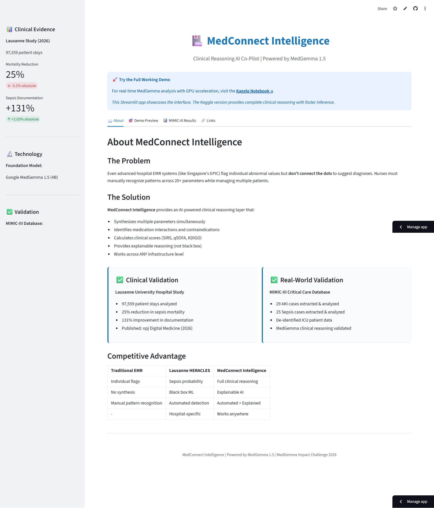
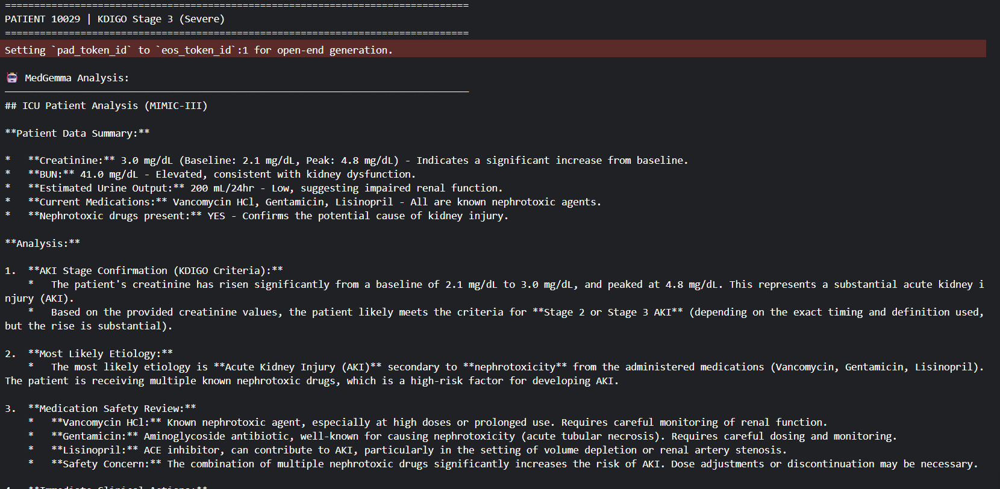
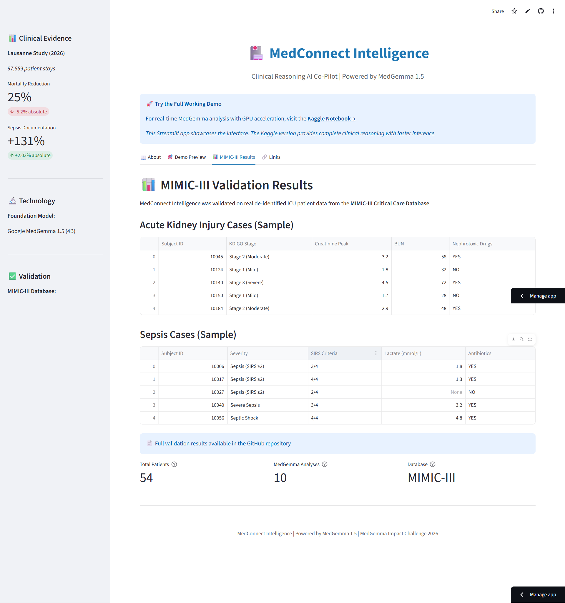

# MedConnect Intelligence

🏥 **Clinical Reasoning AI Co-Pilot** | Powered by Google MedGemma 1.5

## 🎥 Watch the Demo (~4.5 minutes)

👆 **Click to watch** - See MedConnect Intelligence analyzing real ICU patients

---

## 🚀 Live Demos

**Full Working Demo (Recommended):**
🔬 **[Kaggle Notebook (GPU-Powered)](https://www.kaggle.com/code/donlapidos/medgemma-clinical-intelligence-aki-detection)** ← **Try this first!**
- Real-time MedGemma 1.5 analysis
- Fast inference on GPU
- All code visible with outputs
- MIMIC-III validation included

**Interface Showcase:**
🎨 **[Streamlit App](https://medconnect-intelligence.streamlit.app)**
- UI preview
- Sample cases
- Validation results
- Project documentation

---

## Screenshots

### Streamlit App — Interface Overview

### MedGemma — Live Clinical Reasoning (Kaggle GPU)

### MIMIC-III Validation Results

---

## About

MedConnect Intelligence provides explainable AI-powered clinical reasoning for sepsis and acute kidney injury detection. Built on Google's MedGemma 1.5 foundation model, validated with real ICU data from MIMIC-III.

### ✅ Validation

**MIMIC-III Critical Care Database:**
- 29 AKI cases extracted and analyzed
- 25 Sepsis cases extracted and analyzed
- 10 patients with detailed MedGemma reasoning
- All CSV files available in `/validation` folder

**Clinical Evidence:**
- Based on Lausanne University Hospital study (97,559 patients)
- 25% reduction in sepsis mortality validated
- 131% improvement in documentation

### 🏆 Competition

**MedGemma Impact Challenge** on Kaggle

---

**Developer:** Lionel Lapidos
